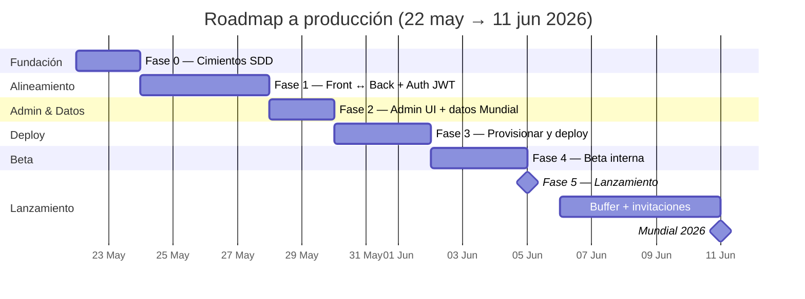

# Plan de trabajo — Prode World Cup 2026

> **Última sesión:** Viernes 29 de mayo de 2026 — **Fase 2: `admin-ui` cerrado** ✅ (siguiente: `fixture-automation`)
> **Deadline blando (deploy):** Viernes 5 de junio de 2026
> **Deadline duro (inicio Mundial):** Jueves 11 de junio de 2026
> **Equipo:** 1 dev (solo)
> **Usuarios objetivo:** amigos (≤ 50 personas)

---

## 1. Decisiones globales

| Tema | Decisión | Estado |
|------|----------|--------|
| Repos | Workspace de Cursor que incluye `prode-frontend` y `prode-backend` lado a lado. Sin monorepo formal. | ✅ Confirmado |
| SDD | Modo **`engram`** (memoria persistente local; sin `openspec/` en git) | ✅ Confirmado |
| TDD | **No estricto.** Tests en zonas críticas: `PointsService`, auth, endpoint de leaderboard. | ✅ Confirmado |
| Auth v1.0 | **Email + password + JWT** (real desde el inicio) | ✅ Confirmado |
| Stack front | Angular 21 standalone + signals + Tailwind | ✅ Vigente |
| Stack back | NestJS 11 + Prisma 7 + PostgreSQL | ✅ Vigente |
| Deploy front | Vercel free tier | ✅ Decidido (provisionar en Fase 3) |
| Deploy back | **Render Web Service free** (cold start ~30s tras inactividad; aceptado) | ✅ Confirmado |
| DB prod | Neon Postgres free | ✅ Decidido (provisionar en Fase 3) |
| Dominio | Subdominio de Vercel inicialmente; dominio propio post-Mundial | ⏳ Opcional |

> **Trade-off del modo engram:** sin `openspec/` versionado, los artefactos SDD (proposals, specs, designs) viven en memoria local. Es más rápido para 1 dev solo, pero si un amigo quisiera contribuir más adelante no vería el historial. Decisión consciente.

---

## 2. Hitos de alto nivel



---

## 3. Plan día a día

### Fase 0 — Cimientos SDD (Vie 22 + Sáb 23)

**Objetivo:** Workspace listo, SDD activo, primer change real corriendo.

- **Vie 22:**
  - [x] Análisis inicial del proyecto.
  - [x] Plan global escrito (este archivo).
  - [x] Confirmar decisiones de la sección 1 (queda solo el deploy del back).
  - [x] Crear `prode.code-workspace` que englobe front + back.
  - [x] Inicializar git en el frontend si falta (`git status` falló).
- **Sáb 23:**
  - [x] Ejecutar `sdd-init` en modo **`engram`** sobre el workspace unificado.
  - [x] Generar `.atl/skill-registry.md` y `AGENTS.md` con convenciones.
  - [x] Agregar ESLint al frontend (config alineada con el back).
  - [x] Primer `sdd-explore`: **"Modelo de fases y puntaje de cara al Mundial 2026"**.

**Salida esperada:** workspace abierto desde Cursor mostrando ambos repos, contexto SDD persistido en engram, primer explore guardado.

**Git (front):** commit `84f501d` en `master` (`chore(fase-0): cimientos SDD, ESLint y plan Mundial 2026`). Rama de trabajo `cursor/fase-0-sdd-foundation` apunta al mismo commit (opcional borrarla).

### Fase 1 — Alineamiento front ↔ back (Dom 24 → Mié 27, 4 días)

**Objetivo:** Que el frontend hable el mismo idioma que el backend; eliminar lógica duplicada; auth real.

**Estado 26-may:** `phase-model-alignment` y `leaderboard-from-backend` cerrados y subidos en ambos repos. Queda `auth-jwt` para la próxima sesión.

- **Dom 24 — Change `phase-model-alignment`**
  - [x] Decidir enum definitivo: mantener los 8 valores del front, expandir el back.
  - [x] Migración Prisma + actualizar `PointsService` con multiplicadores por fase fina.
  - [x] Tests unitarios del cálculo de puntos por cada fase (es código crítico).
  - [x] Frontend deja de calcular nada; consume el campo `points`.
- **Lun 25 — Change `leaderboard-from-backend`**
  - [x] Endpoint `GET /leaderboard` con orden + tie-breakers.
  - [x] Frontend deja de hacer `forkJoin` y agregar; consume el endpoint.
  - [x] Test del servicio del leaderboard (back).
- **Mar 26 + Mié 27 — Change `auth-jwt` (2 días)**
  - [ ] Modelo: agregar `passwordHash` y `role: 'USER' | 'ADMIN'` a `User`. Migración Prisma.
  - [ ] Back día 1: hashing con argon2/bcrypt, `POST /auth/register`, `POST /auth/login` (devuelve `{ user, accessToken }`), guard JWT con `@nestjs/jwt`, decorator `@CurrentUser()`, proteger rutas mutativas, `JWT_SECRET` por env.
  - [ ] Back día 1: tests de `AuthService` (registro, login válido/inválido, token firma OK).
  - [ ] Front día 2: formularios con campo password + confirm password en registro, validaciones, `AuthService.login/register` reescritos contra el endpoint real, almacenar JWT en localStorage, interceptor que adjunta `Authorization: Bearer`, manejo de `401` (logout automático), tests de servicios críticos.
  - [ ] Decisión documentada: sin "olvidé mi contraseña" para v1.0 (queda en v1.1; con 50 usuarios, hacer reset manual).

**Salida esperada:** features `/fixtures` y `/leaderboard` consumen datos reales del back. Auth con JWT funcional end-to-end.

### Fase 2 — Admin + datos del Mundial (Jue 28, Vie 29 — 2 días)

**Objetivo:** Poder cargar resultados reales y tener todos los partidos del Mundial.

- **Jue 28 — Change `admin-ui`**
  - Ruta `/admin` protegida por rol (`role` ya quedó creado en Fase 1).
  - Guard de admin en el front + verificación en el back.
  - Pantalla para listar partidos pendientes y cargar `homeGoals`/`awayGoals`.
  - Recalculo automático (ya existe en back; solo conectar UI).
- **Vie 29 — Change `world-cup-fixture` + polish**
  - Seed con los **48 equipos** y **fixture oficial 2026** (104 partidos).
  - Script `prisma db seed` reproducible (con un dataset JSON commiteado).
  - Verificar fechas en zona horaria correcta (UTC-3 Argentina).
  - UX: estados de carga, error y vacío en cada pantalla.
  - E2E con Playwright **se difiere a post-Mundial** salvo que sobre tiempo en Fase 4.

**Salida esperada:** app completa funcionalmente con datos del Mundial cargados localmente.

### Fase 3 — Provisionar y deploy (Sáb 30, Dom 31, Lun 1-jun)

**Objetivo:** App accesible en internet con datos reales.

- **Sáb 30:**
  - Crear cuenta Neon, base de datos, copiar connection string.
  - Migrar schema y seed a Neon (`prisma migrate deploy` + seed).
  - Crear cuenta Render, deploy del backend, configurar env vars.
  - Healthcheck del back desde fuera (`GET /matches`).
- **Dom 31:**
  - Crear cuenta Vercel, conectar repo del frontend.
  - Configurar `environment.production.ts` con URL del back en Render.
  - Variable `apiBaseUrl` por entorno; deploy preview verde.
  - CORS abierto en el back para el dominio de Vercel.
- **Lun 1-jun:**
  - Smoke test end-to-end en producción.
  - Crear usuario admin de prod, cargar 1 resultado real ficticio y verificar recálculo.
  - Documentar URLs + credenciales en `docs/OPERATIONS.md`.
  - *(Opcional)* Configurar ping externo (UptimeRobot / cron-job.org) cada 10 min en horario de partidos para reducir cold starts — no es necesario, pero mejora la UX en días de uso intenso.

**Salida esperada:** URL pública de Vercel sirviendo el frontend conectado al backend en Render. App usable por cualquiera con el link.

### Fase 4 — Beta interna (Mar 2, Mié 3, Jue 4)

**Objetivo:** Validar con usuarios reales y corregir fricción de UX.

- **Mar 2 — Invitar 2-3 amigos beta**
  - Mensaje corto con el link.
  - Pedirles que registren, hagan el setup, dejen 5 predicciones.
- **Mié 3 — Recoger feedback + fix de showstoppers**
  - Lista de issues priorizados.
  - Solo se atacan bugs y fricciones obvias; **no features nuevas**.
- **Jue 4 — Buffer**
  - Día reservado para lo que se desbordó.
  - Verificar performance con datos reales (¿es lento el leaderboard?).

**Salida esperada:** confianza alta en la app; lista de bugs conocidos en cero o cerca.

### Fase 5 — Lanzamiento (Vie 5-jun) 🎯

- [ ] Tag `v1.0.0` en ambos repos.
- [ ] Deploy final.
- [ ] Mensaje al grupo de amigos con el link de invitación.
- [ ] Crear thread en WhatsApp/Discord para soporte.

### Buffer post-lanzamiento (Sáb 6 → Mié 10)

- Onboarding amigos rezagados.
- Fixes menores reportados.
- Preparar plan de monitoreo del día del kickoff (logs, alertas básicas).

### Mundial (Jue 11-jun) — kickoff

- [ ] Cargar resultado del primer partido apenas termine.
- [ ] Verificar recálculo de puntos y leaderboard en vivo.
- [ ] Disfrutar.

---

## 4. Riesgos y mitigaciones

| Riesgo | Probabilidad | Impacto | Mitigación |
|--------|--------------|---------|------------|
| Drift mayor entre Prisma schema y front | Alta | Alto | Fase 1 lo ataca explícitamente. Idealmente generar tipos compartidos desde Prisma post-Mundial. |
| Render cold start molesto en producción | Media | Medio | Aceptable para amigos. Si molesta, migrar a Railway ($5/mes). |
| Cargar 104 partidos a mano consume tiempo | Alta | Medio | Script de seed con dataset oficial (FIFA o Wikipedia) en JSON. Tarea de Vie 29. |
| Tests insuficientes y bug en cálculo de puntos | Media | Alto | Fase 1 incluye tests unitarios del `PointsService`. Es **bloqueante**, no se difiere. |
| Bug en flow de auth con JWT bloquea login en prod | Media | Crítico | Tests del `AuthService` (back) y del interceptor (front) son bloqueantes. Probar refresh de sesión y expiración en Fase 4. |
| `JWT_SECRET` filtrado / hardcoded | Baja | Crítico | Solo en env vars, nunca en código. Rotación al final de Fase 3. |
| Olvido de password sin reset automático | Media | Bajo | Reset manual (vos como admin actualizás el hash en DB). Documentar en `OPERATIONS.md`. |
| Un amigo carga un resultado equivocado como admin | Media | Alto | Solo 1 admin (vos). Endpoint protegido por rol. |
| Cuota de Neon o Render se acaba | Baja | Alto | Monitorear semanal. Plan B: migrar a Supabase / Railway. |

---

## 5. Definición de "listo" para v1.0

- [ ] Un usuario puede registrarse, hacer el setup inicial y cargar predicciones.
- [ ] El admin puede cargar resultados desde la UI.
- [ ] El leaderboard refleja los puntos en tiempo casi real (refresh manual OK).
- [ ] La app es accesible desde un link público.
- [ ] Funciona razonablemente en mobile (≥ 360px de ancho).
- [ ] No hay errores en consola al navegar las 4 pantallas principales.
- [ ] El cálculo de puntos está cubierto por tests unitarios.

---

## 6. Fuera de alcance (explícito) para v1.0

- "Olvidé mi contraseña" / reset por email (reset manual mientras tanto).
- 2FA.
- Notificaciones push o email.
- Picks de campeón/goleador con validación contra equipos del torneo.
- Múltiples torneos en paralelo.
- Histórico de leaderboards.
- App nativa.
- Internacionalización (queda en español/UTC-3).
- E2E con Playwright (solo unit/integration en zonas críticas).

Estos quedan para **v1.1+** después del 11 de junio.

---

## 7. Próximas acciones (próxima sesión — Fase 2 / `fixture-automation`)

> **Cambio de alcance:** el fixture deja de cargarse a mano. Se incorpora una nueva funcionalidad no prevista en el plan original: **importación automática del fixture** desde una API pública de fútbol y **seguimiento de resultados en vivo (o casi)** que dispara el recálculo de puntaje, conservando siempre el override manual del admin.

1. Abrir workspace `../prode.code-workspace` (front + back).
2. Recuperar contexto Engram: `project: prode-frontend`, topic `prode/session-latest` y `prode/next-fixture-automation`.
3. Confirmar estado git: ambos repos en `master` trackeando `origin/master` (auth-jwt + admin-ui ya pusheados al cerrar la sesión anterior).
4. **Planificar primero** (no implementar de una): hacer la búsqueda web de la API y comparar opciones antes de proponer.
5. Iniciar change **`fixture-automation`** con SDD engram: `sdd-explore` (API + arquitectura de polling) → `sdd-propose` → spec/design/tasks → apply.

### Requisitos de la nueva funcionalidad (para la planificación)

- **Búsqueda web** de una API pública de fútbol que sea **gratis, sencilla y con cobertura del Mundial 2026**. Candidatas a evaluar (validar cuota/cobertura en la sesión): `football-data.org` (free tier), `TheSportsDB` (free), `API-Football` (RapidAPI free tier). Criterios: límite de requests del free tier, si expone fixtures + estado del partido (en juego/finalizado) + marcador en vivo, formato de fechas/UTC, y mapeo a nuestras 8 fases.
- **Importación de fixture** previa al torneo: script/endpoint admin que traiga los 48 equipos y los partidos, mapeando a `Match` (homeTeam, awayTeam, date UTC-3, phase). Reemplaza el seed manual de `world-cup-fixture`.
- **Polling de resultados en vivo**: durante un partido, el backend consulta la API cada *N* segundos/minutos hasta que el partido esté marcado como **finalizado**. Ante un **cambio de marcador**, dispara el recálculo de puntaje de cada predicción de ese partido (fase + total), reutilizando `PointsService` y la lógica de `AdminService.setMatchResultAndRecalculate`.
- **Override manual** del admin siempre disponible (UI actual de `/admin`) por si la API falla o trae datos erróneos; decidir precedencia (¿manual “congela” el partido frente al poller?).
- **Decisiones a tomar en planificación**: scheduler (`@nestjs/schedule` / cron vs intervalo), de dónde sale el calendario de qué partidos pollear, idempotencia del recálculo, manejo de rate limits y errores de la API, almacenamiento del `externalId` del partido para el matcheo.

### Prompt de arranque sugerido

```text
Continuamos Prode WC 2026 — Fase 2 / change fixture-automation.
Abrí ../prode.code-workspace (front + back), leé docs/PLAN.md (§7 y §8) y recuperá contexto con mem_search/mem_context:
project: prode-frontend, topics: prode/session-latest y prode/next-fixture-automation.

Estado actual:
- prode-frontend master -> origin/master ; prode-backend master -> origin/master
- Fase 1 cerrada (phase-model-alignment, leaderboard-from-backend, auth-jwt) y Fase 2 admin-ui cerrada (ruta /admin con guard ADMIN, PATCH /admin/matches/:id/result con recálculo).

Quiero PLANIFICAR esta etapa antes de implementar:
1. Hacé una búsqueda web de una API pública de fútbol gratis, sencilla y con cobertura del Mundial 2026 (evaluá football-data.org, TheSportsDB, API-Football). Compará free tier, cobertura de fixtures + estado del partido + marcador en vivo, y mapeo a nuestras 8 fases.
2. Con eso, arrancá SDD engram: sdd-explore -> sdd-propose -> spec -> design -> tasks. (Implementación recién después.)

Objetivo de la funcionalidad:
- Importar automáticamente el fixture (48 equipos + partidos) en vez de cargarlo a mano.
- Durante cada partido, el backend pollea el resultado cada cierto tiempo hasta que figure como finalizado; ante un cambio de marcador, recalcula el puntaje de cada predicción de ese partido (fase + total) reutilizando PointsService.
- Mantener SIEMPRE el override manual del admin (UI /admin) ante cualquier eventualidad.
- Definir scheduler, rate limits/errores, externalId para matchear partidos e idempotencia del recálculo.

No push salvo que lo pida.
```

> En modo engram, al cerrar un change usar `sdd-archive` + resumen en memoria (sin `openspec/changes/archive/`).

---

## 8. Bitácora de sesiones

| Fecha | Foco | Hecho | Git / Engram |
|-------|------|-------|----------------|
| **Vie 22-may** | Kickoff WC 2026 | Análisis, `PLAN.md`, decisiones globales, fix Engram/Notepad | `session/2026-05-22-prode-kickoff` |
| **Sáb 23-may** | **Fase 0 completa** | `prode.code-workspace`, `git init` front, `sdd-init` engram, `AGENTS.md`, `.atl/skill-registry.md`, ESLint (`ng lint` OK), explore fases/puntaje, merge a `master` | Commit `84f501d` · `prode/session-latest` · `sdd-init/prode-frontend` · `sdd/explore/phase-scoring-world-cup-2026` |
| **Mar 26-may** | **Fase 1 parcial** | `phase-model-alignment` cerrado (8 fases Prisma + `PointsService` + test 9/9) y `leaderboard-from-backend` cerrado (`GET /leaderboard`, front sin agregación local, test 2/2). Ambos repos subidos a GitHub. | Front `4319d36` · Back `master -> origin/master` · `prode/session-latest` · `sdd/phase-model-alignment/apply-progress` · `sdd/leaderboard-from-backend/apply-progress` |
| **Vie 29-may** | **Fase 2 — `admin-ui`** | `admin-ui` implementado y verificado (smoke manual OK): ruta `/admin` con `adminGuard`, `AdminService` → `PATCH /admin/matches/:id/result`, UI de partidos pendientes, nav condicional ADMIN, `User.role` + hidratación desde JWT. `ng test` 11/11, `ng lint` OK. **Hallazgo:** `auth-jwt` (Fase 1) y `admin-ui` estaban **sin commitear** pese a nota previa; se commitean y pushean al cerrar esta sesión. Backend deja de versionar `dist/`. | `sdd/admin-ui/{proposal,spec,design,tasks,apply-progress,verify,archive-report}` · `prode/session-latest` · `prode/next-fixture-automation` |

**Carry-over Fase 2:** iniciar `fixture-automation` — **planificar primero** (búsqueda web de API pública gratis) y recién después implementar import automático de fixture + polling de resultados en vivo con recálculo, manteniendo override manual del admin. Backend sigue siendo fuente de verdad del puntaje.
