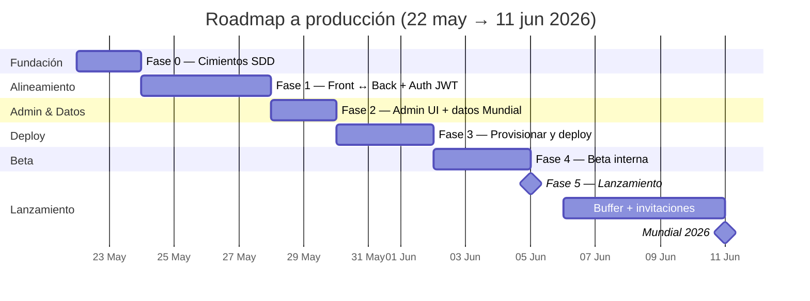

# Plan de trabajo — Prode World Cup 2026

> **Última sesión:** Viernes 19 de junio de 2026 — **Lógica de mata-mata (`knockout-advancement`) implementada y verificada en local; pendiente deploy**
> **Deadline blando (deploy):** ~~Viernes 5 de junio~~ → **Martes 9 de junio de 2026 (hoy)**
> **Deadline duro (inicio Mundial):** Jueves 11 de junio de 2026
> **Equipo:** 1 dev (solo)
> **Usuarios objetivo:** amigos (≤ 50 personas)

---

## 1. Decisiones globales

| Tema | Decisión | Estado |
|------|----------|--------|
| Repos | Workspace de Cursor que incluye `prode-frontend` y `prode-backend` lado a lado. Sin monorepo formal. | ✅ Confirmado |
| SDD | Modo **`engram`** (memoria persistente local; sin `openspec/` en git) | ✅ Confirmado |
| TDD | **No estricto.** Tests en zonas críticas: `PointsService`, auth, endpoint de leaderboard. | ✅ Confirmado |
| Auth v1.0 | **Email + password + JWT** (real desde el inicio) | ✅ Confirmado |
| Stack front | Angular 21 standalone + signals + Tailwind | ✅ Vigente |
| Stack back | NestJS 11 + Prisma 7 + PostgreSQL | ✅ Vigente |
| Deploy front | Vercel free tier | ✅ Decidido (provisionar en Fase 3) |
| Deploy back | **Render Web Service free** (cold start ~30s tras inactividad; aceptado) | ✅ Confirmado |
| DB prod | Neon Postgres free | ✅ Decidido (provisionar en Fase 3) |
| Dominio | Subdominio de Vercel inicialmente; dominio propio post-Mundial | ⏳ Opcional |

> **Trade-off del modo engram:** sin `openspec/` versionado, los artefactos SDD (proposals, specs, designs) viven en memoria local. Es más rápido para 1 dev solo, pero si un amigo quisiera contribuir más adelante no vería el historial. Decisión consciente.

---

## 2. Hitos de alto nivel



---

## 3. Plan día a día

### Fase 0 — Cimientos SDD (Vie 22 + Sáb 23)

**Objetivo:** Workspace listo, SDD activo, primer change real corriendo.

- **Vie 22:**
  - [x] Análisis inicial del proyecto.
  - [x] Plan global escrito (este archivo).
  - [x] Confirmar decisiones de la sección 1 (queda solo el deploy del back).
  - [x] Crear `prode.code-workspace` que englobe front + back.
  - [x] Inicializar git en el frontend si falta (`git status` falló).
- **Sáb 23:**
  - [x] Ejecutar `sdd-init` en modo **`engram`** sobre el workspace unificado.
  - [x] Generar `.atl/skill-registry.md` y `AGENTS.md` con convenciones.
  - [x] Agregar ESLint al frontend (config alineada con el back).
  - [x] Primer `sdd-explore`: **"Modelo de fases y puntaje de cara al Mundial 2026"**.

**Salida esperada:** workspace abierto desde Cursor mostrando ambos repos, contexto SDD persistido en engram, primer explore guardado.

**Git (front):** commit `84f501d` en `master` (`chore(fase-0): cimientos SDD, ESLint y plan Mundial 2026`). Rama de trabajo `cursor/fase-0-sdd-foundation` apunta al mismo commit (opcional borrarla).

### Fase 1 — Alineamiento front ↔ back (Dom 24 → Mié 27, 4 días)

**Objetivo:** Que el frontend hable el mismo idioma que el backend; eliminar lógica duplicada; auth real.

**Estado 26-may:** `phase-model-alignment` y `leaderboard-from-backend` cerrados y subidos en ambos repos. Queda `auth-jwt` para la próxima sesión.

- **Dom 24 — Change `phase-model-alignment`**
  - [x] Decidir enum definitivo: mantener los 8 valores del front, expandir el back.
  - [x] Migración Prisma + actualizar `PointsService` con multiplicadores por fase fina.
  - [x] Tests unitarios del cálculo de puntos por cada fase (es código crítico).
  - [x] Frontend deja de calcular nada; consume el campo `points`.
- **Lun 25 — Change `leaderboard-from-backend`**
  - [x] Endpoint `GET /leaderboard` con orden + tie-breakers.
  - [x] Frontend deja de hacer `forkJoin` y agregar; consume el endpoint.
  - [x] Test del servicio del leaderboard (back).
- **Mar 26 + Mié 27 — Change `auth-jwt` (2 días)**
  - [ ] Modelo: agregar `passwordHash` y `role: 'USER' | 'ADMIN'` a `User`. Migración Prisma.
  - [ ] Back día 1: hashing con argon2/bcrypt, `POST /auth/register`, `POST /auth/login` (devuelve `{ user, accessToken }`), guard JWT con `@nestjs/jwt`, decorator `@CurrentUser()`, proteger rutas mutativas, `JWT_SECRET` por env.
  - [ ] Back día 1: tests de `AuthService` (registro, login válido/inválido, token firma OK).
  - [ ] Front día 2: formularios con campo password + confirm password en registro, validaciones, `AuthService.login/register` reescritos contra el endpoint real, almacenar JWT en localStorage, interceptor que adjunta `Authorization: Bearer`, manejo de `401` (logout automático), tests de servicios críticos.
  - [ ] Decisión documentada: sin "olvidé mi contraseña" para v1.0 (queda en v1.1; con 50 usuarios, hacer reset manual).

**Salida esperada:** features `/fixtures` y `/leaderboard` consumen datos reales del back. Auth con JWT funcional end-to-end.

### Fase 2 — Admin + datos del Mundial (Jue 28, Vie 29 — 2 días)

**Objetivo:** Poder cargar resultados reales y tener todos los partidos del Mundial.

- **Jue 28 — Change `admin-ui`**
  - Ruta `/admin` protegida por rol (`role` ya quedó creado en Fase 1).
  - Guard de admin en el front + verificación en el back.
  - Pantalla para listar partidos pendientes y cargar `homeGoals`/`awayGoals`.
  - Recalculo automático (ya existe en back; solo conectar UI).
- **Vie 29 — Change `world-cup-fixture` + polish**
  - Seed con los **48 equipos** y **fixture oficial 2026** (104 partidos).
  - Script `prisma db seed` reproducible (con un dataset JSON commiteado).
  - Verificar fechas en zona horaria correcta (UTC-3 Argentina).
  - UX: estados de carga, error y vacío en cada pantalla.
  - E2E con Playwright **se difiere a post-Mundial** salvo que sobre tiempo en Fase 4.

**Salida esperada:** app completa funcionalmente con datos del Mundial cargados localmente.

### Fase 3 — Deploy v1 (Mar 9-jun — **hoy, versión mínima**)

**Objetivo:** App accesible en internet **hoy**. Una tarde, 6 tareas. Sin extras.

> **Recortes conscientes:** no `OPERATIONS.md`, no UptimeRobot, no tag `v1.0.0`, no smoke elaborado, no resultado ficticio de prueba, no beta formal (eso pasa a Fase 4). Cold start de Render aceptado.

| # | Tarea | Tiempo | Hecho |
|---|-------|--------|-------|
| **T1** | **Neon:** crear proyecto free, copiar `DATABASE_URL` (connection pooling). Desde local: `npx prisma migrate deploy` apuntando a Neon. | ~15 min | [ ] |
| **T2** | **Render:** Web Service free conectado a `prode-backend`. Build: `npm install && npx prisma generate && npm run build`. Start: `npm run start:prod`. Env: `DATABASE_URL`, `JWT_SECRET` (random 32+ chars), `CORS_ORIGIN` (URL Vercel — se actualiza en T5), `FOOTBALL_DATA_API_TOKEN` (si ya lo tenés). Verificar `GET /matches` desde el browser. | ~30 min | [ ] |
| **T3** | **Front config (código):** crear `environment.production.ts` con URL de Render, agregar `fileReplacements` en `angular.json`, agregar `vercel.json` con rewrite SPA. Commit + push. | ~15 min | [ ] |
| **T4** | **Vercel:** importar repo `prode-frontend`. Build: `ng build`. Output: `dist/prode-app/browser`. Deploy production. | ~20 min | [ ] |
| **T5** | **CORS + admin + datos:** actualizar `CORS_ORIGIN` en Render con la URL de Vercel y redeploy. Registrarte en prod → en Neon SQL: `UPDATE "User" SET role = 'ADMIN' WHERE email = 'tu@email.com'`. Re-login → importar fixture desde `/admin` (`POST /admin/fixture/import`). | ~15 min | [ ] |
| **T6** | **Smoke mínimo:** login, fixtures cargan, hacer 1 predicción, leaderboard responde. Compartir link con 1 amigo. | ~10 min | [ ] |

**Salida esperada:** link de Vercel funcionando end-to-end. Listo para invitar amigos mañana (Fase 4 acelerada).

### Fase 4 — Beta interna (Mar 2, Mié 3, Jue 4)

**Objetivo:** Validar con usuarios reales y corregir fricción de UX.

- **Mar 2 — Invitar 2-3 amigos beta**
  - Mensaje corto con el link.
  - Pedirles que registren, hagan el setup, dejen 5 predicciones.
- **Mié 3 — Recoger feedback + fix de showstoppers**
  - Lista de issues priorizados.
  - Solo se atacan bugs y fricciones obvias; **no features nuevas**.
- **Jue 4 — Buffer**
  - Día reservado para lo que se desbordó.
  - Verificar performance con datos reales (¿es lento el leaderboard?).

**Salida esperada:** confianza alta en la app; lista de bugs conocidos en cero o cerca.

### Fase 5 — Lanzamiento (Vie 5-jun) 🎯

- [ ] Tag `v1.0.0` en ambos repos.
- [ ] Deploy final.
- [ ] Mensaje al grupo de amigos con el link de invitación.
- [ ] Crear thread en WhatsApp/Discord para soporte.

### Buffer post-lanzamiento (Sáb 6 → Mié 10)

- Onboarding amigos rezagados.
- Fixes menores reportados.
- Preparar plan de monitoreo del día del kickoff (logs, alertas básicas).

### Mundial (Jue 11-jun) — kickoff

- [ ] Cargar resultado del primer partido apenas termine.
- [ ] Verificar recálculo de puntos y leaderboard en vivo.
- [ ] Disfrutar.

---

## 4. Riesgos y mitigaciones

| Riesgo | Probabilidad | Impacto | Mitigación |
|--------|--------------|---------|------------|
| Drift mayor entre Prisma schema y front | Alta | Alto | Fase 1 lo ataca explícitamente. Idealmente generar tipos compartidos desde Prisma post-Mundial. |
| Render cold start molesto en producción | Media | Medio | Aceptable para amigos. Si molesta, migrar a Railway ($5/mes). |
| Cargar 104 partidos a mano consume tiempo | Alta | Medio | Script de seed con dataset oficial (FIFA o Wikipedia) en JSON. Tarea de Vie 29. |
| Tests insuficientes y bug en cálculo de puntos | Media | Alto | Fase 1 incluye tests unitarios del `PointsService`. Es **bloqueante**, no se difiere. |
| Bug en flow de auth con JWT bloquea login en prod | Media | Crítico | Tests del `AuthService` (back) y del interceptor (front) son bloqueantes. Probar refresh de sesión y expiración en Fase 4. |
| `JWT_SECRET` filtrado / hardcoded | Baja | Crítico | Solo en env vars, nunca en código. Rotación al final de Fase 3. |
| Olvido de password sin reset automático | Media | Bajo | Reset manual (vos como admin actualizás el hash en DB). Documentar en `OPERATIONS.md`. |
| Un amigo carga un resultado equivocado como admin | Media | Alto | Solo 1 admin (vos). Endpoint protegido por rol. |
| Cuota de Neon o Render se acaba | Baja | Alto | Monitorear semanal. Plan B: migrar a Supabase / Railway. |

---

## 5. Definición de "listo" para v1.0

- [ ] Un usuario puede registrarse, hacer el setup inicial y cargar predicciones.
- [ ] El admin puede cargar resultados desde la UI.
- [ ] El leaderboard refleja los puntos en tiempo casi real (refresh manual OK).
- [ ] La app es accesible desde un link público.
- [ ] Funciona razonablemente en mobile (≥ 360px de ancho).
- [ ] No hay errores en consola al navegar las 4 pantallas principales.
- [ ] El cálculo de puntos está cubierto por tests unitarios.

---

## 6. Fuera de alcance (explícito) para v1.0

- "Olvidé mi contraseña" / reset por email (reset manual mientras tanto).
- 2FA.
- Notificaciones push o email.
- Picks de campeón/goleador con validación contra equipos del torneo.
- Múltiples torneos en paralelo.
- Histórico de leaderboards.
- App nativa.
- Internacionalización (queda en español/UTC-3).
- E2E con Playwright (solo unit/integration en zonas críticas).

Estos quedan para **v1.1+** después del 11 de junio.

---

## 7. Próximas acciones (sesión actual — Fase 3 / `deploy-v1`)

**Estado:** Fases 0–2 cerradas. Backend y frontend en `master` con fixture-automation, scoring v2, bonus torneo, bloqueos pre-kickoff. Artefacto SDD: `sdd/deploy-v1/explore` en Engram.

### Orden de ejecución (hoy)

1. **T1 Neon** — crear DB, `prisma migrate deploy` desde local.
2. **T2 Render** — deploy backend, verificar `GET /matches`.
3. **T3 Código front** — `environment.production.ts`, `fileReplacements`, `vercel.json`.
4. **T4 Vercel** — deploy frontend.
5. **T5 CORS + admin + fixture import** — ver tabla Fase 3.
6. **T6 Smoke mínimo** — login → predicción → leaderboard.

### Env vars Render (referencia rápida)

| Variable | Valor |
|----------|-------|
| `DATABASE_URL` | Connection string pooled de Neon |
| `JWT_SECRET` | String random 32+ caracteres |
| `CORS_ORIGIN` | URL de Vercel (ej. `https://prode-xxx.vercel.app`) |
| `FOOTBALL_DATA_API_TOKEN` | Token football-data.org (opcional pero recomendado) |
| `FIXTURE_POLL_ENABLED` | `true` |

### Prompt de arranque sugerido

```text
Continuamos Prode WC 2026 — Fase 3 deploy-v1 (online hoy).
Workspace prode.code-workspace, contexto Engram: sdd/deploy-v1/explore y prode/session-latest.
Seguir docs/PLAN.md § Fase 3 (6 tareas T1–T6).
Empezar por T1 Neon + T3 código front en paralelo si podés.
```

> Post-deploy: Fase 4 acelerada (invitar amigos mañana 10-jun). Tag v1.0.0 el día del kickoff (11-jun).

---

## 8. Bitácora de sesiones

| Fecha | Foco | Hecho | Git / Engram |
|-------|------|-------|----------------|
| **Vie 22-may** | Kickoff WC 2026 | Análisis, `PLAN.md`, decisiones globales, fix Engram/Notepad | `session/2026-05-22-prode-kickoff` |
| **Sáb 23-may** | **Fase 0 completa** | `prode.code-workspace`, `git init` front, `sdd-init` engram, `AGENTS.md`, `.atl/skill-registry.md`, ESLint (`ng lint` OK), explore fases/puntaje, merge a `master` | Commit `84f501d` · `prode/session-latest` · `sdd-init/prode-frontend` · `sdd/explore/phase-scoring-world-cup-2026` |
| **Mar 26-may** | **Fase 1 parcial** | `phase-model-alignment` cerrado (8 fases Prisma + `PointsService` + test 9/9) y `leaderboard-from-backend` cerrado (`GET /leaderboard`, front sin agregación local, test 2/2). Ambos repos subidos a GitHub. | Front `4319d36` · Back `master -> origin/master` · `prode/session-latest` · `sdd/phase-model-alignment/apply-progress` · `sdd/leaderboard-from-backend/apply-progress` |
| **Vie 29-may** | **Fase 2 — `admin-ui`** | `admin-ui` implementado y verificado (smoke manual OK): ruta `/admin` con `adminGuard`, `AdminService` → `PATCH /admin/matches/:id/result`, UI de partidos pendientes, nav condicional ADMIN, `User.role` + hidratación desde JWT. `ng test` 11/11, `ng lint` OK. **Hallazgo:** `auth-jwt` (Fase 1) y `admin-ui` estaban **sin commitear** pese a nota previa; se commitean y pushean al cerrar esta sesión. Backend deja de versionar `dist/`. | `sdd/admin-ui/{proposal,spec,design,tasks,apply-progress,verify,archive-report}` · `prode/session-latest` · `prode/next-fixture-automation` |
| **Lun 8-jun** | **Fase 2 cierre + prode-v1** | `fixture-automation`, scoring v2, bonus 50/50, REGLAS, bloqueos pre-kickoff. PENDIENTES.md cerrado. Push remoto back `2a96766`, front `3ff222d`. | `prode/session-latest` · tests back 71/71 |
| **Mar 9-jun** | **Fase 3 — `deploy-v1` plan** | Plan simplificado a 6 tareas (Neon + Render + Vercel). Recortes: OPERATIONS.md, UptimeRobot, smoke elaborado. | `sdd/deploy-v1/explore` |
| **Jue 18-jun** | **Rediseño de logo** | Relevamiento de identidad ('Prode 93', dark+oro), prompt a Nano Banana (4 opciones). Elegido logo metálico '9 + trofeo Copa del Mundo + 3'. Procesado con `sharp`: máscara de extracción (quita watermark + fondo), set optimizado en `public/` (`brand-93.png` 32KB, `favicon.svg` 6.5KB, `favicon.ico` 7.3KB, `apple-touch-icon.png` 28KB; los dos últimos antes daban 404). `brand-mark` migrado a ``. Build dev OK, **deployado a prod (Vercel) vía push a master**. | Front `ed942de` · `prode/logo-redesign-2026` |
| **Vie 19-jun** | **Lógica de mata-mata (`knockout-advancement`)** | Cambio para la fase eliminatoria (sin empates). **Schema/migración** (`20260619110000_knockout_advancement`, nullable): enums `TeamSide`/`MatchDecision`, `Phase`+`ROUND_OF_32` (Dieciseisavos, ×2), `Match.winnerSide`/`decidedBy`, `Prediction.advancingTeam`. **API** (football-data.org): se leen `score.winner`/`duration` (antes solo `fullTime`) → `winnerSide`/`decidedBy`. **Puntaje**: `PointsService` reemplaza el gate por signo por **gate de equipo que avanza** en knockout (`(4 + bonus)×mult` si acierta el avance, si no 0; bonus sobre marcador 90'+prórroga). **Validación**: predicción de avance derivada del marcador decisivo o requerida en empate (front + back); admin elige avance al cargar resultado knockout. **UI**: selector "¿Quién avanza?" en fixture y admin (auto/bloqueo si decisivo, editable si empate), etiqueta penales/prórroga. **Backup runbook** `prode-backend/docs/db-backup-restore.md` (branch Neon + `pg_dump` + restore). Verificado: back **98/98**, front **29/29**, ambos builds OK. **Pendiente:** deploy (backup → `migrate deploy` Neon → redeploy → `POST /admin/fixture/import` cuando la API publique los cruces). Guía local: `prode-frontend/docs/knockout-local-testing.md`. | `sdd/knockout-advancement` · `prode/session-latest` |

**Carry-over:**
- **Mata-mata:** falta el rollout a prod (ver guía de prueba local `docs/knockout-local-testing.md` primero). Los partidos de knockout aún no existen en la API; se prueban creándolos a mano (`POST /matches`).
- Verificar deploy de Vercel en verde y logo/favicon en prod. Opcionales: quitar redundancia del '93' en header; `brand-mark` `lg`=512 upscalea el source de 256px.
